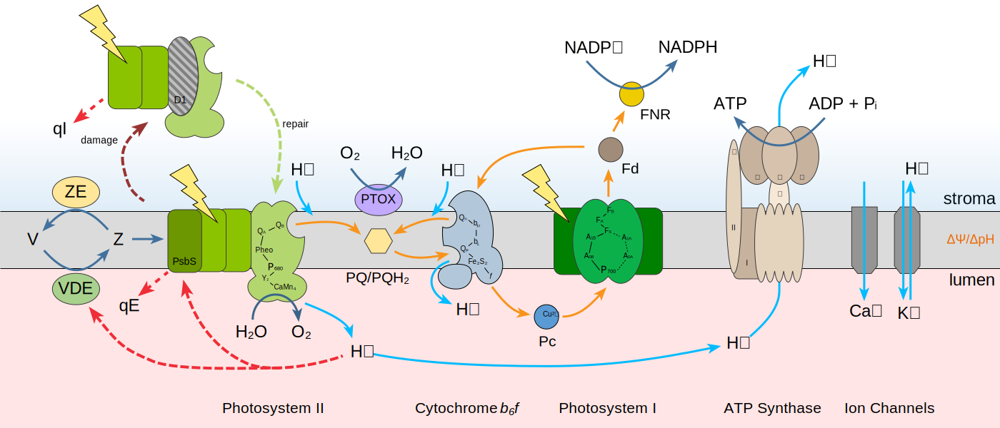

# Photosynthesis Scheme

> Generate schemes of the photosyntheric machinery



Visit <https://kuhlgert.com/photosynthesis-scheme/> to generate a customized Photosynthesis Scheme for your poster or slides or install the app and run it on your own machine.

## Install

The installation requires you to have Node.js and NPM installed. After that run the command below to install the application.

```bash
npm install
```

## Start the Application

Run the command below to start the application.

```bash
npm start
```

## Use the Library

In case you want to use the library in your own app, find the available functions below. The HTML output of settings, presets, and references uses the classes compatible with [Bootstrap 5.x](https://getboostrap.com).

### The HTML file

```html
<!-- HTML File -->
<html>
  ...
  <body>
    <div id="svg"></div>
  </body>
  ...
</html>
```

### The JavaScript File

```JavaScript
// Initiate
const photosynthesis = new Photosynthesis();

// Return the SVG and add to element
document.querySelector("#svg").innerHTML = photosynthesis.build();

// Get the Settings Object
photosynthesis.settings();

// Get the Settings as HTML
photosynthesis.settingsHTML();

// Get the Presets as Object
photosynthesis.presets();

// Get the Presets as HTML
photosynthesis.presetsHTML();

// Reset Settings
photosynthesis.reset();

// Update Settings
photosynthesis.update(photosynthesis.getPreset(event.target.value));

// Get Figure legend
photosynthesis.legend();

// Get References as Array
photosynthesis.references();

// Get References HTML formatted
photosynthesis.referencesHTML();
```


### References

The drawings are based on the figures from the literature below.

Kramer, D. M., Avenson, T. J. and Edwards, G. E. (2004) **Dynamic flexibility in the light reactions of photosynthesis governed by both electron and proton transfer reactions.** Trends Plant Sci 9, 349-357.